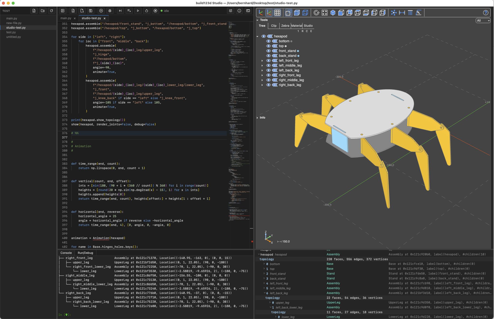

# build123d Studio

An IDE for [build123d](https://github.com/gumyr/build123d): a Monaco editor, a [three-cad-viewer](https://github.com/bernhard-42/three-cad-viewer) viewport, a real [Jupyter console](https://github.com/jupyter/jupyter_console) and a variable explorer, in one window, with an encapsulated Python environment it builds for itself on first start.



_The four panes, all describing the same object: the script that built the hexapod, the model it produced, the console it printed to, and the assembly unrolled by its children in the explorer._

A typical session is just a few lines of Python:

```python
from build123d import *
from build123d_studio import show

show(Box(1, 2, 3))
```

## What it is

A desktop application running on macOS, Windows and Linux, for writing build123d code and seeing the result. It is one window with four panes — editor, 3D viewer, console, variable explorer — and it brings its own Python.

- **You do not need a Python environment, and you do not need to know how to make one.** There is nothing to `pip install`, no virtualenv to activate, no interpreter to choose. On first start the application downloads a pinned CPython and a pinned [uv](https://github.com/astral-sh/uv), builds a virtual environment of its own and installs build123d and everything else it needs into it. It never touches a system or user Python, and nothing it does is visible to any other Python on the machine.

- **One release is one environment.** A given build pins one uv and one CPython — 3.14.6 today — so two people running the same release get the same interpreter and the same packages, rather than whatever happened to be current on the day each of them first started it. Both move when the application is rebuilt and retested.

- **Everything it writes is per-user**, and none of it goes into the application's own folder — so an installation can be read-only, and replacing it disturbs nothing. The environment lives in `~/Library/Application Support/build123d-studio/runtime` on macOS, `%LOCALAPPDATA%\build123d-studio\runtime` on Windows and `~/.local/share/build123d-studio/runtime` on Linux; the settings, snippets and logs sit beside it, in the roaming half of `AppData` on Windows. Uninstalling does not remove the environment; the path is in the About dialog and in the log. On a machine whose policy will not execute binaries out of a user-writable directory, `BUILD123D_STUDIO_ENV_ROOT` [puts the environment somewhere else](https://bernhard-42.github.io/ocp_viewer_docs/viewers/build123d_studio/first_run/#moving-the-environment).

## Installation

### Download and verify

Download the latest release from [the Releases page](https://github.com/bernhard-42/build123d-studio/releases), compute the checksum of the downloaded file

- **macOS**: `shasum -a 256 build123d-studio-*.dmg`
- **Windows**: `certutil -hashfile build123d-studio-*.zip SHA256`
- **Linux**: `sha256sum build123d-studio-*.AppImage`

and compare it against the values in `SHA256SUMS.txt` on the same Releases page. With the GitHub CLI [gh](https://cli.github.com/) installed, the build provenance can be verified directly:

```sh
gh attestation verify build123d-studio-*.dmg --repo bernhard-42/build123d-studio
```

### Install

The ordinary way for your platform: drag the `.app` to Applications on macOS, unzip the Windows package, store the Linux AppImage where you like it.

### Getting past the OS gatekeepers

- **macOS**: builds are signed ad hoc, with no Developer ID and no notarisation, so the first run is blocked with _"Apple could not verify 'build123d Studio' is free of malware"_. Open **System Settings → Privacy & Security**, find _"build123d Studio" was blocked to protect your Mac_ under _Security_, and click **Open Anyway**. Alternatively, run `xattr -dr com.apple.quarantine "/Applications/build123d Studio.app"` before double-clicking the icon.
- **Windows**: builds are unsigned, so SmartScreen warns on first run. Use **More info → Run anyway**.
- **Linux**: the application uses the system webview and needs WebKitGTK (`libwebkit2gtk-4.1-0`, or `libwebkit2gtk-4.0-37` on older releases) — install it if it is not already there. Mark the AppImage executable (`chmod +x build123d-studio-*.AppImage`), or the desktop treats it as a data file.

### The first start

It takes a few minutes and shows what it is doing: a splash overlay reports each step while it downloads uv, downloads CPython, builds a virtual environment of its own and installs build123d and everything else it needs — several hundred megabytes in total, including the language server and the OpenCascade bindings.

Every start after the first goes straight to the window: the environment is reconciled against the locked package list while the kernel warms in the background. The kernel indicator in the toolbar says `starting`, then `idle`, and you can type before it gets there.

See [First Run](https://bernhard-42.github.io/ocp_viewer_docs/viewers/build123d_studio/first_run/) for the full account.

## Usage

### Two ways to run your code

This is the thing worth understanding before anything else, because they behave differently on purpose.

**On the kernel.** `Run Cell` (`Shift-Enter`), `Run Selection` and `Run All` send code to a Jupyter kernel that stays alive between runs, and the console at the bottom is a real `jupyter console` attached to that same kernel. So everything you run leaves its names behind, and you can poke at them in the console afterwards — build a shape with `Shift-Enter`, then type `part.volume` below and get an answer. The variable explorer shows that same namespace and expands on demand. `# %%` on its own line marks a cell boundary, as in Jupyter and VS Code.

**As a file, in a process of its own.** `Run File` (`Ctrl-F5`) and `Debug File` (`F5`) save the buffer and run the _file from disk_ in a separate process, with the same interpreter and the same environment. Nothing it defines reaches the kernel, and when it ends the process is gone with everything in it. That is the mode for "does this script actually work from a clean start". Output appears in the **Run/Debug** tab beside the console; a `show()` in the file still reaches the same viewer, because the process is given the viewer's address.

See [Running code](https://bernhard-42.github.io/ocp_viewer_docs/viewers/build123d_studio/running/) and [Debugging](https://bernhard-42.github.io/ocp_viewer_docs/viewers/build123d_studio/debugging/).

### Drawing anything

```python
from build123d import *
from build123d_studio import show

b = Box(1, 2, 3)
show(b)
```

`show_all()` draws everything drawable in scope, which is usually what you want while exploring. New files start from a template with this in it, and the template is editable in Settings.

### Opening a folder

`Open Folder` gives you a file tree and makes that folder the project: the kernel's working directory is the folder root and stays there, so a relative path in your code means the same thing wherever the file you are editing sits. With no folder open, the working directory follows the active file instead. One folder is open at a time.

### Opening projects from a terminal

Each package carries a `studio` launcher beside the application. Copy it somewhere on your PATH — it does not have to stay where it came from, and nothing needs installing with a password:

```
cp "/Applications/build123d Studio.app/Contents/MacOS/studio" ~/bin/studio   # macOS
cp /path/to/build123d-studio/studio ~/bin/studio                             # Linux
copy C:\path\to\build123d-studio\studio.cmd %USERPROFILE%\bin\studio.cmd     # Windows
```

Then, from any project directory:

```
studio                  # open this directory as the project
studio /path/to/folder  # open that folder as the project
studio main.py          # open main.py, with its folder as the project
```

Every form starts a new instance, so several projects can be open at once. That matters most on macOS, where double-clicking an already-running application activates the existing window rather than starting a second one — `studio` is the only way to get two there.

Start the application once before using it. The launcher finds the application by reading a location the application records on each start, which is what lets you copy it anywhere.

### Extra topics

The full documentation lives at [bernhard-42.github.io/ocp_viewer_docs](https://bernhard-42.github.io/ocp_viewer_docs/) — the [build123d Studio chapter](https://bernhard-42.github.io/ocp_viewer_docs/viewers/build123d_studio/overview/) covers this application's specifics; everything below is a deep link into it.

#### Getting started

- [Overview](https://bernhard-42.github.io/ocp_viewer_docs/viewers/build123d_studio/overview/)
- [Installation](https://bernhard-42.github.io/ocp_viewer_docs/viewers/build123d_studio/installation/) and [First Run](https://bernhard-42.github.io/ocp_viewer_docs/viewers/build123d_studio/first_run/)
- [The window](https://bernhard-42.github.io/ocp_viewer_docs/viewers/build123d_studio/window/) — the panes, the [toolbar](https://bernhard-42.github.io/ocp_viewer_docs/viewers/build123d_studio/window/#the-toolbar), the [folder tree](https://bernhard-42.github.io/ocp_viewer_docs/viewers/build123d_studio/window/#the-folder-tree) and the [bottom pane](https://bernhard-42.github.io/ocp_viewer_docs/viewers/build123d_studio/window/#the-bottom-pane)
- [Best practices for configuring](https://bernhard-42.github.io/ocp_viewer_docs/config/)

#### Working with the application

- [Running code](https://bernhard-42.github.io/ocp_viewer_docs/viewers/build123d_studio/running/) — [cells](https://bernhard-42.github.io/ocp_viewer_docs/viewers/build123d_studio/running/#cells), [running a file](https://bernhard-42.github.io/ocp_viewer_docs/viewers/build123d_studio/running/#as-a-file-in-a-process-of-its-own), [where your code runs](https://bernhard-42.github.io/ocp_viewer_docs/viewers/build123d_studio/running/#where-your-code-runs)
- [Debugging](https://bernhard-42.github.io/ocp_viewer_docs/viewers/build123d_studio/debugging/), including [visual debugging](https://bernhard-42.github.io/ocp_viewer_docs/viewers/build123d_studio/debugging/#visual-debugging) — the model redrawn at every stop
- [Console and variables](https://bernhard-42.github.io/ocp_viewer_docs/viewers/build123d_studio/console_variables/) — and [what a click in the explorer will and will not compute](https://bernhard-42.github.io/ocp_viewer_docs/viewers/build123d_studio/console_variables/#what-a-click-will-and-will-not-compute)
- [The editor](https://bernhard-42.github.io/ocp_viewer_docs/viewers/build123d_studio/editor/) — [completion and hover](https://bernhard-42.github.io/ocp_viewer_docs/viewers/build123d_studio/editor/#completion-hover-and-signatures), [ruff formatting](https://bernhard-42.github.io/ocp_viewer_docs/viewers/build123d_studio/editor/#formatting), [snippets](https://bernhard-42.github.io/ocp_viewer_docs/viewers/build123d_studio/editor/#snippets), [the new-file template](https://bernhard-42.github.io/ocp_viewer_docs/viewers/build123d_studio/editor/#the-new-file-template)
- [Commands and shortcuts](https://bernhard-42.github.io/ocp_viewer_docs/viewers/build123d_studio/commands/) — the [keymap](https://bernhard-42.github.io/ocp_viewer_docs/viewers/build123d_studio/commands/#the-keymap), [rebinding](https://bernhard-42.github.io/ocp_viewer_docs/viewers/build123d_studio/commands/#rebinding) and [the menus](https://bernhard-42.github.io/ocp_viewer_docs/viewers/build123d_studio/commands/#the-menus)

#### Packages and settings

- [Packages and the environment](https://bernhard-42.github.io/ocp_viewer_docs/viewers/build123d_studio/packages/) — where build123d comes from, [what each button does](https://bernhard-42.github.io/ocp_viewer_docs/viewers/build123d_studio/packages/#the-buttons), and [additional packages](https://bernhard-42.github.io/ocp_viewer_docs/viewers/build123d_studio/packages/#additional-packages)
- [Viewer settings](https://bernhard-42.github.io/ocp_viewer_docs/viewers/build123d_studio/workspace_config/)
- [The config system](https://bernhard-42.github.io/ocp_viewer_docs/config/) — settings, `set_defaults`, and show keywords

#### Working with the viewer

- [The CAD Viewer window](https://bernhard-42.github.io/ocp_viewer_docs/viewer/) and [mouse and keys](https://bernhard-42.github.io/ocp_viewer_docs/mouse_keys/)
- [Measurement tools](https://bernhard-42.github.io/ocp_viewer_docs/measure/)
- [Object selection tool](https://bernhard-42.github.io/ocp_viewer_docs/selector/)
- [Physically based rendering Studio](https://bernhard-42.github.io/ocp_viewer_docs/pbr_studio/)
- [ImageFace — use a 2-D image as a reference plane](https://bernhard-42.github.io/ocp_viewer_docs/image_face/)

#### Python `show*` commands

- [Use the `show` command](https://bernhard-42.github.io/ocp_viewer_docs/show/)
- [Use the `show_object` command](https://bernhard-42.github.io/ocp_viewer_docs/show_object/)
- [Use the `push_object` and `show_objects` commands](https://bernhard-42.github.io/ocp_viewer_docs/push_object/)
- [Use the `show_all` command](https://bernhard-42.github.io/ocp_viewer_docs/show_all/)
- [Use the `set_viewer_config` command](https://bernhard-42.github.io/ocp_viewer_docs/set_viewer_config/)

#### Python API reference

- [Additional Python API](https://bernhard-42.github.io/ocp_viewer_docs/api/) (`show_clear`, `save_screenshot`, `status`, …)
- [Animation](https://bernhard-42.github.io/ocp_viewer_docs/animation/)
- [Color maps](https://bernhard-42.github.io/ocp_viewer_docs/colormaps/)
- [Enums reference](https://bernhard-42.github.io/ocp_viewer_docs/enums/) (`Camera`, `Collapse`, `Render`, `AnalysisTool`, `UiTab`, `Studio*`)

#### Help

- [Troubleshooting](https://bernhard-42.github.io/ocp_viewer_docs/viewers/build123d_studio/troubleshooting/) — the [health chip](https://bernhard-42.github.io/ocp_viewer_docs/viewers/build123d_studio/troubleshooting/#the-health-chip), the [Backend tab](https://bernhard-42.github.io/ocp_viewer_docs/viewers/build123d_studio/troubleshooting/#the-backend-tab), the [log files](https://bernhard-42.github.io/ocp_viewer_docs/viewers/build123d_studio/troubleshooting/#the-log-files), and [what a report should carry](https://bernhard-42.github.io/ocp_viewer_docs/viewers/build123d_studio/troubleshooting/#about-and-what-a-report-should-carry)
- [How the pieces fit together](https://bernhard-42.github.io/ocp_viewer_docs/viewers/build123d_studio/concepts/)

## Licence

Apache-2.0. See `LICENSE`, `NOTICE` and `THIRD_PARTY_LICENSES.md`.
